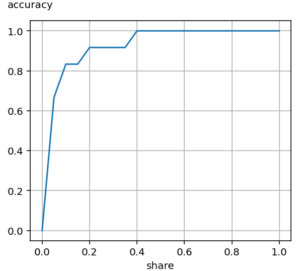
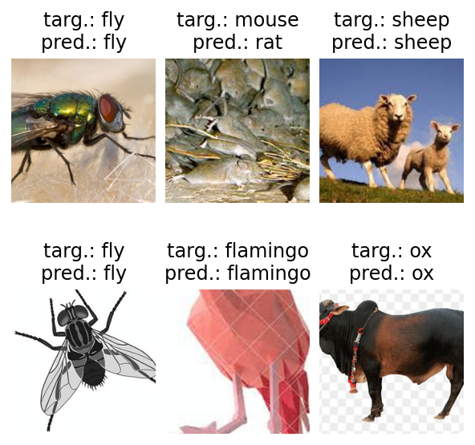

## Introduction
There is a usual way of solving classification problems using artificial neural network models described in books [[link](https://course.fast.ai/Resources/book.html "\"Deep Learning for Coders with Fastai and PyTorch: AI Applications Without a PhD\", by J. Howard, S. Gugger, 2020")], articles [[link](https://towardsdatascience.com/getting-started-with-pytorch-image-models-timm-a-practitioners-guide-4e77b4bf9055-2/ "\"Getting Started with PyTorch Image Models (timm): a practitioner’s guide\", by Chris Hughes, 2022.02.01")], courses [[link](https://huggingface.co/learn/computer-vision-course/unit3/vision-transformers/vision-transformers-for-image-classification)], and library documentation [[link](https://docs.pytorch.org/tutorials/beginner/blitz/cifar10_tutorial.html)], [[link](https://docs.pytorch.org/tutorials/beginner/transfer_learning_tutorial.html)], [[link](https://huggingface.co/docs/transformers/en/tasks/image_classification)]. It is based on the selection of a pre-trained model with the installment of a blank classifier head, which are then fine-tuned on a task-specific dataset. The idea for this work appeared during the development of a classifier with a varying number of classes. The list of classes was mostly the same after each update, but some number of them could disappear, and new ones were included. Therefore, it was necessary to fine-tune a model each time on a whole set of data with lots of old and a few new instances. The problem here is that a classifier model stores data in a tangled form, and it is hard to separate one class embedding vector from other embedding vectors. The ability to separate the embeddings could provide a way to change only those embeddings that have to be changed without fine-tuning the entire model. This is where embedding creation, similarity search, and vector databases come in.

The technique below is applied to an image classification task, but it also works well for sentence classification problems. This approach is a good first step to deal with image and sentence classification tasks, while fine-tuning of a classifier model is a possible second step if the results from the first step are not good enough.

## Libraries and environment
This work is done by using [Python](https://github.com/python/cpython) with some popular deep learning and supportive libraries.
- [PyTorch](https://github.com/pytorch/pytorch) is used as the core artificial neural network framework.
- [timm](https://github.com/huggingface/pytorch-image-models) (PyTorch Image Models) is used for working with the state-of-the-art computer vision models.
- [Sentence Transformers](https://github.com/UKPLab/sentence-transformers) provides access to a semantic search function.
- [sklearn](https://github.com/scikit-learn/scikit-learn) is used to build a [confusion matrix](https://en.wikipedia.org/wiki/Confusion_matrix).
- [Pillow](https://github.com/python-pillow/Pillow) (Python Imaging Library (Fork)) is used for image processing.
- [NumPy](https://github.com/numpy/numpy) and [SciPy](https://github.com/scipy/scipy) are used as supportive mathematical tools.
- [pandas](https://github.com/pandas-dev/pandas) is used for its [Comma Separated Values](https://en.wikipedia.org/wiki/Comma-separated_values) (CSV) file support.
- [tqdm](https://github.com/tqdm/tqdm) renders progress bars.
- [matplotlib](https://github.com/matplotlib/matplotlib) is used for plotting.

A standalone x86-64 computer with CUDA support was used during this work.
- CPU: Intel Core i5-9300H
- RAM: 16 GB, DDR4-3200, dual channel
- SSD: Intel 660p, 1 TB, NVMe
- GPU: NVIDIA GeForce RTX 2060 Mobile, 6 GB
- Operating system: Windows 10 Home 64-bit, version 22H2
- CUDA Toolkit: v12.9
- Package manager: Miniforge3 v25.3.0-1
- IDE: Spyder IDE v6.0.5

To be clear, no Linux, Jupyter Notebook, or Google Colab were used.

The list of installed packages is shown below.


```text

```


## Algorithm description
Building of a system:
1. Separate a whole dataset into 2 or 3 datasets: training, validation, and test.
2. Make it possible to iterate through dataset items related to a particular class.
3. Choose a data transformation algorithm that will be used to preprocess each dataset item. Data augmentation techniques can be used. The final choice can be made after experimenting.
4. Choose an artificial neural network model that can produce embedding vectors out of dataset items. There can be several candidate models for this role, and the final choice can be made after experimenting.
5. Choose a way of creating a single embedding vector out of an item set related to this class. The vector represents the whole class.  
Note. In the general case, there can be multiple ways of embedding vector creation and several embedding vectors representing one class. It is not the case in this article.
6. Choose database organization to store and search embedding vectors. The main feature of the database here is its algorithm for finding similarity between a query vector and stored vectors. Several alternatives may be considered.  
Note. In the general case, there can be several embedding vectors for a query object.
7. Construct an embedding vector creation algorithm. It must be able to fill up a database with the vectors created out of a training dataset.
8. Construct a validation / test algorithm to check how well the system works on unseen data. Different metrics can be used, but accuracy may be considered the main one.
9. Construct an algorithm to process arbitrary queries to the database.

Database creation:
1. Run an embedding vector creation algorithm on a training dataset in order to build a vector database. The algorithm creates an embedding vector out of the training dataset for each class. All items of the same class eventually produce only one embedding vector, which represents this class. Then the algorithm places the vectors into the database.
2. Check the accuracy of the system and other metrics on a validation dataset. Items from the validation dataset are converted into embedding vectors, which are compared with the vectors inside the previously created database in order to define predicted labels of the validation data. If the known target label of a validated item coincides with the label of a respective database response, then the prediction is correct. The more correct predictions there are, the more accuracy there is.

The use of the system:

Use an arbitrary query processing algorithm. When a query occurs, the model is used to create a new embedding vector from an input object. Then find the most similar vector in the vector database to the query vector. The label of the found database vector is the answer to the query.

## Building datasets
[Sourav Banerjee's Animal Image Dataset (90 Different Animals)](https://www.kaggle.com/datasets/iamsouravbanerjee/animal-image-dataset-90-different-animals) is used in this work. This non-standard dataset has been chosen for several reasons. It is small enough to be processed on an average personal computer, has a few flaws to be realistic, does not have enough data to provide stable validation results, and has no ready-to-use application programming interface. These features make working with this dataset similar to some real-world tasks. On the other hand, dozens of (newbie) researchers approved its usability in their works. Of course, there could be another dataset or a subset of a popular dataset like ImageNet.

Data augmentation techniques can be applied to virtually enlarge this small dataset. In particular, resizing, cropping, horizontal flipping, and color jittering. Data augmentation can be applied to training, validation, and test datasets. Whether it should be applied or not should be discovered during research. In this work, only one data-augmented item instance of each item can be used for database creation. In the general case, there can be multiple data-augmented instances of each item.

Loading and preprocessing images from a solid-state drive is the most time-consuming part of a script execution process in this work. It is worth considering the use of a caching mechanism to store loaded data in virtual memory for tasks like this one. However, this may be difficult in the general case, particularly if a dataset is too big to be fully placed in random access memory. Caching is not used here because it does not suit data augmentation techniques well. Probably, caching could be used in the case of downsizing the original images and storing them in PIL or Tensor formats prepared for further transformations.

Script execution time can be reduced using the multiprocessing feature of a "`torch.DataLoader`" object. In this case, data loading can occur in separate processes. It is inapplicable if there should be reproducibility since multiprocessing works differently on Linux and NT systems, which leads to different results of random number generator calls [[link](https://pythonforthelab.com/blog/differences-between-multiprocessing-windows-and-linux/ "\"Differences of Multiprocessing on Windows and Linux\", by Aquiles Carattino, 2020.06.13")].

## Embedding generation
At the time of starting this work, there was a quick and simple way to get a notion of the best currently publicly available models for image classification; it is called [Papers With Code](https://paperswithcode.com). At the moment (August 2025) of writing this text, the site link redirects to its GitHub [page](https://github.com/paperswithcode); the site has been shut down since June 2025 [[link](https://github.com/paperswithcode/paperswithcode-data/issues/45 "\"Issue on https://paperswithcode.com/ website\", #45, by aljohaniabeer, 2025.06.30")]. It is bad for future works, but in the case of this one, it is possible to get access to interesting materials using Internet Archive [[link](https://web.archive.org/web/20250701181017/https://paperswithcode.com/sota/image-classification-on-imagenet)]. Some of the best models for image classification are available via the [timm](https://huggingface.co/timm) library. In particular, [timm Top-20 Fastest Models](https://huggingface.co/collections/timm/timm-top-20-fastest-models-655d84afb5da99edaf3a51c3), [Fastest timm models > 80% Top-1 ImageNet-1k](https://huggingface.co/collections/timm/fastest-timm-models-80-top-1-imagenet-1k-6562773db9218ed1a776eced), [Fastest timm models > 83% ImageNet-1k Top-1](https://huggingface.co/collections/timm/fastest-timm-models-83-imagenet-1k-top-1-656278c92c671784e2e037a4) were considered for their small size and relatively high accuracy. It is worth noticing here that these models were trained on the ImageNet-1k dataset, which has images of 1000 classes, while the Banerjee's Animal Image Dataset has only 90 classes. Therefore, potentially, these models can show more accuracy here than on the ImageNet-1k dataset.

In this work, some models produce significantly higher accuracy if a new task-specific head is trained (without backbone fine-tuning) during transfer learning rather than using them for embedding creation. For example, [EfficientViT](https://arxiv.org/abs/2305.07027 "\"EfficientViT: Memory Efficient Vision Transformer with Cascaded Group Attention\", by Liu et al., 2023.05.11") family.

Experiments showed that distilled [TinyViT](https://arxiv.org/abs/2207.10666 "\"TinyViT: Fast Pretraining Distillation for Small Vision Transformers\", by Wu et al., 2022.07.21") models [[link](https://huggingface.co/timm/tiny_vit_5m_224.dist_in22k_ft_in1k)], [[link](https://huggingface.co/timm/tiny_vit_11m_224.dist_in22k_ft_in1k)], [[link](https://huggingface.co/timm/tiny_vit_21m_224.dist_in22k_ft_in1k)] are far ahead (> 4 % of accuracy) of other considered models in this particular task. These models have been chosen as the main models for this work (see table 1).

Table 1. Distilled TinyViT models for embedding creation.

| Model name | Params<br>(M) | GMACs | Activations<br>(M) | Image size | Embedding<br>size |
| :--------: | :-----------: | :---: | :----------------: | :--------: | :---------------: |
| tiny_vit_5m_224<br>.dist_in22k_ft_in1k | 5.4 |1.2 | 9.3 | 224 x 224 | 320 |
| tiny_vit_11m_224<br>.dist_in22k_ft_in1k | 11.0 | 1.9 | 10.7 | 224 x 224 | 448 |
| tiny_vit_21m_224<br>.dist_in22k_ft_in1k | 21.2 | 4.1 | 15.9 | 224 x 224 | 576 |

Notes: 1) the models are pre-trained on ImageNet-22k and fine-tuned on ImageNet-1k datasets; 2) [GMACs](https://en.wikipedia.org/wiki/Multiply%E2%80%93accumulate_operation) - giga multiply-accumulate operations per second.

Creation of a vector that represents each class in a database is a task similar to [pooling](https://arxiv.org/abs/2009.07485 "\"Pooling Methods in Deep Neural Networks, a Review\", by H. Gholamalinezhad, H. Khosravi, 2020"). Different techniques can be applied to a set of vectors of the same size to create one output vector. One of the most obvious is averaging. Suppose there is a set of embedding vectors of one class

$`V_{i}=\begin{pmatrix} v_{i,0} & \cdots & v_{i,n-1} \end{pmatrix}`$,
$`S=\begin{pmatrix} V_{0} \\ \cdots \\ V_{m-1} \end{pmatrix}`$,
$`S=\begin{pmatrix}
v_{0,0} & \cdots & v_{0,n-1} \\
\cdots & \cdots & \cdots \\
v_{m-1,0} & \cdots & v_{m-1,n-1}
\end{pmatrix}`$,

where *m* - the number of embedding vectors, *n* - the size of an embedding vector, *V<sub>i</sub>* - the *i*-th embedding vector, *v<sub>i,j</sub>* - the *j*-th element of the *i*-th embedding vector, *S* - a matrix of size (*m* x *n*) that contains embedding vectors. Then the average embedding vector is defined as

$`V_{avg}=\frac{1}{m}\begin{pmatrix} \displaystyle\sum_{i=0}^{m-1}v_{i,0} & \cdots & \displaystyle\sum_{i=0}^{m-1}v_{i,n-1} \end{pmatrix}`$.

This technique was applied as the first alternative in this work and yielded satisfying results. Other techniques were not tested.

There are several measures to compare a request vector with database vectors in practice. For example, [cosine similarity](https://en.wikipedia.org/wiki/Cosine_similarity) from the Sentence Transformers library [[link](https://sbert.net/examples/sentence_transformer/applications/semantic-search/README.html)], [Euclidean / L2 distance](https://en.wikipedia.org/wiki/Euclidean_distance) from the FAISS library [[link](https://faiss.ai/cpp_api/struct/structfaiss_1_1IndexFlatL2.html)], and [inner product](https://en.wikipedia.org/wiki/Inner_product_space) from the FAISS library [[link](https://faiss.ai/cpp_api/struct/structfaiss_1_1IndexFlatIP.html)]. In this work, only cosine similarity was tested. It does not require using a separate database class; a "`torch.Tensor`" object stores the database vectors. The author's previous experience tells that the accuracy and performance of a system with FAISS may be very similar to this one, but verification of this hypothesis is beyond the scope of this work. FAISS becomes more useful when there are many more vectors in a database and direct search methods are inapplicable.

Different subsets of data items (images in this case) are used for database creation and validation. A validation procedure helps to assess the accuracy of a search in the database. [Top-k accuracy](https://scikit-learn.org/stable/modules/model_evaluation.html#top-k-accuracy-score) is used here besides accuracy as an additional measure of the system quality.

## Simulation results and their precision
Suppose 80 % of 5400 images are used for a database creation, 10 % for validation, and 10 % for the final test. Hence, there are only 540 images used for validation. The total number of classes is 90, which means 6 images per class are in a validation dataset. One misclassified image costs 0.185 % total accuracy and 16.7 % class accuracy. In practice, validation results are unstable and strongly depend on a validation subset selection. Accuracy may vary by &pm; 2 % from a sole validation result. I. e. after getting one validation accuracy value, another simulation with another validation subset may bring an accuracy value that differs by &pm; 2 % from the first one. Different techniques exist to mitigate this kind of problem.

[Cross-validation](https://en.wikipedia.org/wiki/Cross-validation_(statistics)) is based on an idea of the iterative use of different subsets of one dataset for training and validation. A final validation metric (for example, accuracy) can be estimated as an average value of the validation metric measured in a series of experiments. If 80 % of a dataset is for training and 20 % is for validation, then there are 5 disjoint validation subsets, which means that all available data will be used for the final validation results. However, if 5 measure values are not enough to calculate the final value with required [confidence](https://en.wikipedia.org/wiki/Confidence_interval), another data partitioning technique should be used.

[Bootstrap resampling](https://en.wikipedia.org/wiki/Bootstrapping_(statistics)) is a technique of the iterative use of random dataset partitioning to create training and validation subsets. It requires many iterations to create statistics that show distributions of metric values by percentiles. It does not require the preliminary knowledge of distribution laws, and this is a big advantage of this technique.

Each iteration of dataset partitioning requires execution of training and validation procedures, which consume respective computational resources and time. In order to reduce the number of iterations, distribution law knowledge or hypothesis may be used. Several values of a validation metric can be enough to calculate distribution parameters with required confidence. For example, suppose that accuracy calculated for different validation subsets can be approximately described by [Student's *t*-distribution](https://en.wikipedia.org/wiki/Student%27s_t-distribution). Of course, unlike *t*-distribution, which has infinite tails, accuracy values are distributed between 0 and 1 inclusively. Probably, the most precise way is to find the true distribution law and get its parameters from experimental data; a slightly worse way is to use something like a [metalog distribution](https://en.wikipedia.org/wiki/Metalog_distribution) that can approximate a wide variety of statistics. However, *t*-distribution is used here for its simplicity as an approximation near the mean value. A set of expressions to calculate the mean accuracy value is given below

$`\mu_{samp}=\frac{1}{n}\displaystyle\sum_{i=0}^{n-1}x_{i}`$,
$`\sigma_{samp}=\sqrt{\frac{1}{n-1}\displaystyle\sum_{i=0}^{n-1}(x_{i}-\mu_{samp})^2}`$,

$`p(\mu_{samp}-\delta_{req}<\mu_{true}<\mu_{samp}+\delta_{req})=p_{req}`$,
$`\delta_{req}=t(p_{req},n-1)\frac{\sigma_{samp}}{\sqrt{n}}`$,

$`\mu_{true}=\mu_{samp}\pm\delta_{req}`$ with $`p_{req}`$ confidence,

where *x<sub>i</sub>* - the *i*-th experimental value of an observed variable, *n* - the size of a sample, *&mu;<sub>samp</sub>* and *&mu;<sub>true</sub>* - sample and true mean values, *&sigma;<sub>samp</sub>* and *&sigma;<sub>true</sub>* - [unbiased sample](https://math.oxford.emory.edu/site/math117/besselCorrection/) and true standard deviations, *&delta;<sub>req</sub>* - the margin of error, *p<sub>req</sub>* - required confidence level, *t*(*preq*, *n* – 1) - two-sided critical value for a given confidence level *p<sub>req</sub>* and degrees of freedom (*n* – 1).

Theoretically, it may be possible to improve the accuracy of this system by fine-tuning a model on a classification task using this particular dataset. The shortage of data, imprecise results, and already achieved high accuracy values complicate this task. A single validation accuracy value after fine-tuning of the classifier is not enough to assess the progress because the value highly likely will be inside an interval where 95 % of the values lie. To mitigate this issue, the model can be fine-tuned and validated several times in order to reduce the confidence interval of the accuracy mean value. This problem may be a subject of future work.

Table 2 represents simulation results of 3 distilled TinyViT models. In practice, it is much easier to notice the difference in accuracy between 5M and 11M models than between 11M and 21M models. It is interesting to find how an error rate decreases when a larger model is used.

5M to 11M: $`(0.966-0.951)/(1-0.951)\approx0.306`$.

11M to 21M: $`(0.973-0.966)/(1-0.966)\approx0.206`$.

Maybe it is not obvious, but despite the little accuracy differences, the larger models here, actually, provide significant improvement in prediction quality by reducing the error rate.

Table 2. Simulation results for distilled TinyViT models.

| Model name | Encoder<br>params (M) | Accuracy | Top-4<br>accuracy |
| :--------: | :-------------------: | :------: | :---------------: |
| tiny_vit_5m_224<br>.dist_in22k_ft_in1k| 5.07 | 0.951 &pm; 0.002 | 0.993 &pm; 0.001 |
| tiny_vit_11m_224<br>.dist_in22k_ft_in1k | 10.5 | 0.966 &pm; 0.002 | 0.995 &pm; 0.001 |
| tiny_vit_21m_224<br>.dist_in22k_ft_in1k | 20.6 | 0.973 &pm; 0.002 | 0.996 &pm; 0.001 |

Notes: 1) 80 % of the whole dataset is for training / encoding and 20 % is for validation; 2) the average accuracy is based on 20 simulations with arbitrary dataset partitioning.

Model accuracy shows average prediction accuracy through all classes. This number does not show whether all classes have similar accuracy or some classes have significantly higher or lower accuracy than the average number. It is not a big deal to assess prediction accuracy when there are, for example, 2 or 10 classes because it does not take too much time to check accuracy for all classes. The problem steadily increases when the number of classes rises.

In probability theory, there is a [cumulative distribution function](https://en.wikipedia.org/wiki/Probability_density_function) (CDF) that gives the probability that a random variable is not greater than a specific value. It is a non-negative, monotonically non-decreasing function bounded between 0 and 1. A similar function can describe accuracy dependency on the share of classes. The share of classes and accuracy for each class are real numbers in the [0, 1] interval. For a given share of classes, accuracy is not greater than a provided value. For an ideal classifier, it is a horizontal line with a value of 1. The function can be called a cumulative accuracy function (CAF). The idea of this function originally came in an attempt to assess classifier quality with tens of thousands of classes. The function used in this work shows the share of problematic classes.

A cumulative accuracy function in picture 1 shows that some classes are significantly less predictable than others. For example, 0.35 share of classes have accuracy not greater than 0.9167. Here are the classes with accuracy &le; 0.8: duck (0.500), rat (0.583), possum (0.583), whale (0.667), mouse (0.750), and ox (0.750). This information can be used for further data analysis and system improvement.

  
Picture 1. Cumulative accuracy function of a system based on the TinyViT 5M model.

Picture 2 shows some examples of images with their true and predicted labels. Most of such examples show only correct predictions, but this instance was selected because it contains an incorrect one. Probable reasons for the incorrect prediction are the mice and rats resemblance (not each human neural network can distinguish a mouse from a rat) and the low quality of the picture. Although the system somehow managed to identify a flamingo from that cropped and gridded picture of a (paper?) flamingo model.

  
Picture 2. Some predictions of a system based on the TinyViT 5M model.

## Project files
The project files are listed below in alphabetical order with short descriptions.


```python

```


The main class is "`DatasetMaker`" that randomly splits the whole Banerjee's dataset into training, validation, and test datasets with the "`make_datasets`" method. "`restore_datasets`" can restore datasets using their previously stored states.

"`Animal90`" is a dataset class with necessary methods to build PyTorch data loaders and operate with underlying data.

"`augment_data`" is a data augmentation function used to randomly transform the original dataset images.


```python

```


Implementation of a cumulative accuracy function. The function is calculated from an accuracy array for a selected number of points.


```python

```


Creation and validation of a vector database are implemented in the "`Engine`" class. It works with a given artificial neural network model, datasets (for training, validation, and test), and configuration settings. Its main methods inform a user about the current progress of a respective complex operation.

"`encode`" method creates a vector database using a training dataset. A model produces an embedding vector for each dataset item (i. e. a transformed image), which are then averaged for each item class (cats, dogs, etc.).

"`evaluate`" method is used to calculate prediction accuracy on a selected dataset. A model produces an embedding vector for each request. Then a special algorithm searches the most similar vectors in the database. It calculates accuracy and top-k accuracy. Mainly it is useful to get validation results.

"`infer`" method is used to process arbitrary user requests. The logic is similar to that from the "`evaluate`" method, but it uses arbitrary input data instead of using a particular dataset.


```python

```


The main program is written in a script file. It describes calculations necessary for this research. The script contains different code sections, which can be called separately, but mostly they require pre-execution of a previous section. The code sections:
- Global constants used during a script run.
- Loading of an artificial neural network model and creation of an "`engine.Encoder`" instance with that model.
- After an encoder object has been created, it is necessary to create a vector database and assess the accuracy of answers that the system produces. It is done in a "`for`" loop, which creates datasets with respective data loaders, and after that, runs "`Encoder.encode`" and "`Encoder.evaluate`" methods. The loop is capable of collecting prediction accuracy using different dataset partitioning in order to calculate the mean accuracy.
- Calculation of the mean accuracy and the mean top-k accuracy with confidence intervals when there is more than one dataset partitioning. Finally, it prints the simulation results in a human-readable format.
- Saving of the embedding vectors with related dataset partitioning if the operation is required.
- Calculation and plotting of a cumulative accuracy function.
- Creation of a list of the least accurate classes.
- Manual checking of the system work by forming a request with a randomly chosen image from a validation dataset. "`Encoder.infer`" method processes the request. It prints thorough request and response information.
- Visual checking picks up 6 random images from a validation dataset and forms a request to the system. It draws images with their true and predicted labels.


```python

```


There are common recommendations on how to make results reproducible using PyTorch [[link](https://docs.pytorch.org/docs/stable/notes/randomness.html)]. They were used here with some extra features.

It is unnecessary and, maybe, even improper to turn off randomness during most of the training and validation runs, because they show a variety of results and may point to some data and algorithmic issues. On the other hand, it is appropriate to have the final results reproducible.


```python

```


There are functions to save and load an embedding vector database. A file in CSV format is used to store the vectors, and the file is placed into a [ZIP](https://en.wikipedia.org/wiki/ZIP_(file_format)) archive for compression.

A couple of other functions are capable of saving and loading an artificial neural network model after transfer learning with respective dataset information. The latter is important for reusing the datasets since they are created randomly by default. The checkpoints do not store the full dataset data but only the names of images and labels in order to achieve a smaller size.


```python

```


There are some general functions that can be useful in different deep learning projects. One of them is a function to check [CUDA](https://en.wikipedia.org/wiki/CUDA) and [bfloat16 format](https://en.wikipedia.org/wiki/Bfloat16_floating-point_format) support. Another handy function returns a device (a CPU or a CUDA device) to place an artificial neural network on.

A special scaler class is used for mixed precision calculations [[link](https://docs.pytorch.org/tutorials/recipes/recipes/amp_recipe.html)] in transfer learning. The design of this scaler is aimed to avoid a known issue when an optimizer step can be called before a scheduler step, which causes an error [[link](https://discuss.pytorch.org/t/optimizer-step-before-lr-scheduler-step-error-using-gradscaler/92930)]. Note that it actually does not make much sense to use mixed precision in this work for performance reasons.

A context manager wrapper around a "[`cProfile.Profile`](https://docs.python.org/3/library/profile.html)" object is used for convenient activation of the profiler when it is necessary. It also has a method to save profiling data in binary and human-readable formats.


```python

```


There is a function to visualize predictions. It shows images, target labels, and predicted labels. It is worth it to visually control the results of model work when it is possible.

Another function draws a cumulative accuracy function plot.

## Conclusion
This article describes a viable approach to solving a classification task using a pre-trained artificial neural network model without fine-tuning. It is based on the use of an embedding vector database and cosine similarity search. The presented image classification system has up to 0.973 validation accuracy on the Banerjee's Animal Image Dataset, which has 90 classes. The core of the system is one of the distilled TinyViT models with 5.07 - 20.5 million parameters.

Due to the relatively small size of the dataset (5400 images), a special technique was used to increase the precision of the final accuracy calculation. Different training and validation subsets were partitioned in order to calculate the sample mean validation accuracy.

The experience of this work shows that although it is possible to use a small dataset to build an image classifier (with only 60 images per class), it is hard to assess its accuracy precisely and therefore improve it. Special techniques, like cross-validation and bootstrapping, can be applied to mitigate this issue and improve the precision of the final accuracy calculation, but they require extra computational and time resources.
